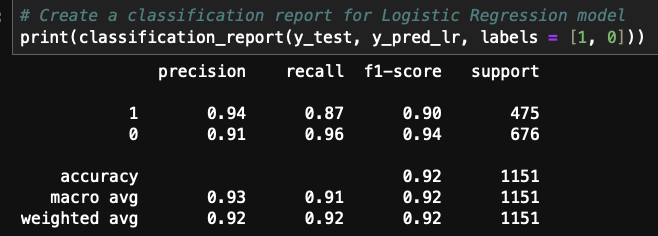
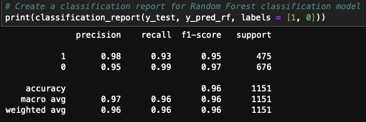
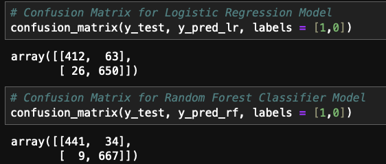

# classification-challenge  
This challenge uses a dataset, provided by ISP, containing email information and two possible classifications: spam and not spam.  
Develop a supervised machine learning (ML) model that will accurately detect spam emails so it can filter them out of its customers' inboxes.  
Two classification models were created to fit the dataset and evaluate the models.  
First data was split into X_train, X_test, y_train, y_test using **train_test_split**  
Then StandardScaler was used to scale the features data.  
Logistic Regression Model was created and fit and predict.  
Also Random Forest Classifier Model was created.  

Accuracy score for both the models were created.  

- Logistic Regression Accuracy = 0.9226759339704604  
- Random Forest Classifier Accuracy = 0.9626411815812337  

The Random Forest Classifier has a higher accuracy, suggesting it performs better in terms of overall correct classifications.
Created Random Forest Classiifer model by varying n_estimators values from 50 to 300. Random Forest classifier model seem to give highest accuracy score when n_estimators=150.  

  
     
  

Confusion Matrix -  

  

After evaluating additional metrics it appears Random Forest model is a better fit.  

